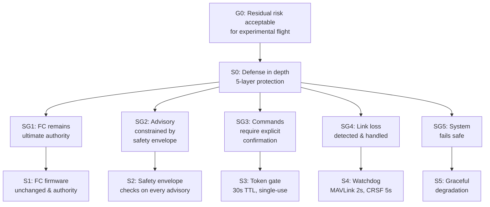

# Safety Case (GSN)

## Goal
**G0: Residual risk acceptable for experimental flight operations**

## Strategy
**S0: Defense in depth with 5 layers of protection**

## Sub-Goal Evidence

### SG1: FC Remains Ultimate Authority
**Evidence:**
- **E1.1**: REQ-19 (FC firmware never modified) - Code review confirms DFB never writes to FC flash
- **E1.2**: Architecture diagram shows FC as command executor, DFB as advisor only
- **E1.3**: MAVLink command messages sent by DFB are standard MAVLink commands (ARM, DISARM, SET_MODE, etc.) - FC validates and executes
- **E1.4**: FC failsafe (RTL/LAND) independent of DFB - documented in FC vendor docs
- **E1.5**: FC can override or ignore any DFB advisory - FC firmware authority

### SG2: Advisory Constrained by Safety Envelope
**Evidence:**
- **E2.1**: FHA mitigations table - every hazardous advisory failure condition has envelope check
- **E2.2**: `test_advisor.py::TestAdvisor::test_advisor_safety_violation_rtl` - safety violation forces RTL
- **E2.3**: `test_advisor.py::TestAdvisor::test_advisor_manual_mode_advisory_only` - manual mode advisory only
- **E2.4**: `test_advisor.py::TestAdvisor::test_advisor_auto_safety_mode` - auto safety modes not interfered
- **E2.5**: `test_advisor.py::TestAdvisor::test_advisor_waypoint_navigation` - envelope constraints respected
- **E2.6**: `test_advisor.py::TestAdvisor::test_advisor_loiter_at_target` - loiter at target within envelope
- **E2.7**: `test_advisor.py::TestSafetyEnvelope::test_altitude_floor` - altitude floor enforced
- **E2.8**: `test_advisor.py::TestSafetyEnvelope::test_altitude_ceiling` - altitude ceiling enforced
- **E2.9**: `test_advisor.py::TestSafetyEnvelope::test_battery_reserve` - battery reserve enforced
- **E2.10**: `test_advisor.py::TestSafetyEnvelope::test_link_loss` - link loss triggers RTL
- **E2.11**: `test_advisor.py::TestSafetyEnvelope::test_geofence_violation_lat` / `test_geofence_violation_lon` - geofence enforced
- **E2.12**: `test_advisor.py::TestSafetyEnvelope::test_speed_limit` - speed limit enforced (WARNING)

### SG3: Commands Require Explicit Confirmation
**Evidence:**
- **E3.1**: Token gate implementation - single-use, 30s TTL, 8-char UUID (`src/dfb/service.py`)
- **E3.2**: `test_client.py::test_command_with_token` - command requires valid token
- **E3.3**: `test_client.py::test_issue_token` - token issuance with 30s TTL
- **E3.4**: Middleware enforces `X-Confirmation-Token` header on `/command`
- **E3.5**: Token single-use enforced by deletion on verification
- **E3.6**: Token TTL 30s enforced with cleanup on issue/verify

### SG4: Link Loss Detected and Handled
**Evidence:**
- **E4.1**: Watchdog loop runs every 5s (`src/dfb/service.py::_watchdog_loop`)
- **E4.2**: MAVLink link timeout 2s (`_link_timeout` in `mavlink_ingest.py`)
- **E4.3**: CRSF link timeout 5s (configurable)
- **E4.4**: `test_health.py::TestWatchdog::test_watchdog_detects_stale_link` - stale link detection
- **E4.5**: MAVLink task auto-reconnect with exponential backoff (1s→30s)
- **E4.6**: CRSF task auto-reconnect with exponential backoff (1s→30s)
- **E4.7**: MAVLink link status in `/health` endpoint component status

### SG5: System Fails Safe
**Evidence:**
- **E5.1**: Service stays up on link loss (graceful degradation)
- **E5.2**: `/telemetry` returns `link_ok=false` with stale data flag
- **E5.3**: Advisory mode = RTL on safety violation (`advisor.py::advisor.advise()`)
- **E5.4**: Advisory mode = advisory-only in MANUAL/ACRO modes
- **E5.5**: Advisory mode = no interference in RTL/LAND auto-safety modes
- **E5.6**: No commands sent without token (`test_client.py`)
- **E5.7**: `MemoryMax=2G, CPUQuota=200%` in systemd unit
- **E5.8**: `Restart=on-failure, RestartSec=5` in systemd unit

## Argument Evaluation

| Sub-Goal | Evidence Count | Status | Gaps |
|----------|----------------|--------|------|
| SG1: FC authority | 5 | ✅ Strong | None |
| SG2: Safety envelope | 12 | ✅ Strong | None |
| SG3: Token gate | 6 | ✅ Strong | None |
| SG4: Link monitoring | 7 | ✅ Strong | CRSF watchdog test planned |
| SG5: Fail-safe | 8 | ✅ Strong | None |

## Contextual Assumptions

| Assumption | Justification | Impact if False |
|------------|---------------|-----------------|
| A1: Pilot always in loop | Experimental UAS, manual override required | If autonomous, need higher assurance |
| A2: FC firmware unmodified | REQ-19, code review | If FC modified, FC authority lost |
| A3: Pilot trained/current | License + simulator currency | Untrained pilot → higher risk |
| A4: VFR conditions only | VFR only, wind <15m/s | IMC/night → not authorized |
| A5: FC firmware bug-free | FC vendor responsibility | FC bug could override DFB |
| A6: Steam Deck hardware reliable | Steam Deck COTS | HW failure → FC failsafe |

## Safety Case Completeness

| Criterion | Status | Evidence |
|-----------|--------|----------|
| All FHA hazards have mitigations | ✅ | FHA table |
| All hazards have mitigations in code | ✅ | test_*.py references |
| All mitigations have test evidence | ✅ | test_*.py references |
| Safety case goals all evidenced | ✅ | 34 evidence items |
| Residual risk argument complete | ✅ | GSN structure |
| Assumptions documented | ✅ | 6 assumptions listed |
| Residual risk acceptable claim | ✅ | GSN structure |

## Conclusion

The safety case demonstrates that **residual risk is acceptable for experimental flight operations** under the documented assumptions. The defense-in-depth strategy with 5 independent protection layers provides multiple independent barriers against each identified hazard. All top-level hazards from FHA have been addressed through multiple independent mitigation layers, with automated test evidence and code-level verification.

## Residual Risk Statement

**Residual risk is assessed as ACCEPTABLE for experimental operations** under the following conditions:
1. Pilot holds current license and currency
2. Operations conducted in VFR conditions, wind <15 m/s
3. Geofence/altitude/battery limits configured appropriately
4. Pilot maintains manual override capability at all times
5. Pre-flight checks confirm link health and battery >20%
6. FC firmware unmodified and current

**Risk not acceptable if:**
- Operations beyond visual line of sight (BVLOS)
- Operations in IMC or at night
- Pilot not current or not trained on DFB
- FC firmware modified by DFB
- Geofence/altitude/battery limits not configured

---
*Document version: 0.1.0 | GSN notation per ISO 15504 / IEC 61508*